<!-- Stats 卡片 -->
<picture>
  <source media="(prefers-color-scheme: dark)"  srcset="./profile/stats-dark.svg" />
  <source media="(prefers-color-scheme: light)" srcset="./profile/stats-light.svg" />
  
</picture>

<table width="100%">
  <tr>
    <td width="50%" valign="top">
      
    </td>
    <td width="50%" valign="top">
      
    </td>
  </tr>

  <tr>
    <td valign="top">
      
    </td>
    <td valign="top">
      
    </td>
  </tr>

  <tr>
    <td valign="top">
      
    </td>
    <td valign="top">
      
    </td>
  </tr>
</table>
