  
  

<table width="100%">
  <tr>
    <td width="50%" valign="top">
      
    </td>
    <td width="50%" valign="top">
      
    </td>
  </tr>

  <tr>
    <td valign="top">
      
    </td>
    <td valign="top">
      
    </td>
  </tr>

  <tr>
    <td valign="top">
      
    </td>
    <td valign="top">
      
    </td>
  </tr>
</table>
